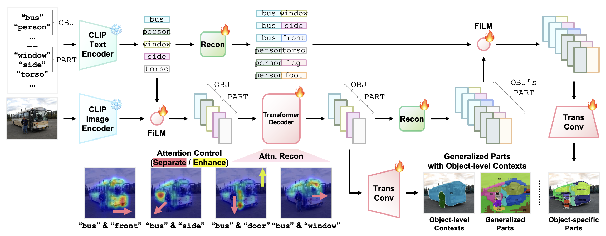
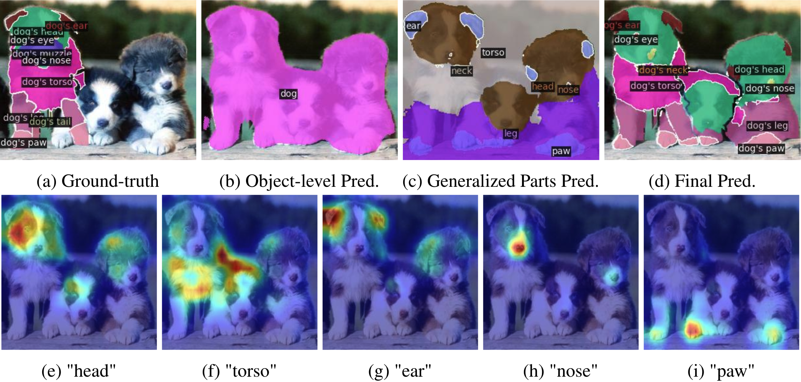

<!--

PartCLIPSeg (arXiv 2024.06)

Authors
* Jiho Choi (https://github.com/JihoChoi)
* Seonho Lee (https://github.com/glanceyes)

-->

<h2 align="center">
    Understanding Multi-Granularity for Open-Vocabulary Part Segmentation
</h2>

<h5 align="center">
    Jiho Choi<sup>1 *</sup>, Seonho Lee<sup>1 *</sup>, Seungho Lee<sup>2</sup>, Minhyun Lee<sup>2</sup>, Hyunjung Shim<sup>1</sup><br>
    (* indicates equal contributions)<br>
    <sup>1</sup>Graduate School of Artificial Intelligence, KAIST, Republic of Korea<br>
    <sup>2</sup>School of Integrated Technology, Yonsei University, Republic of Korea<br>
    <code>{jihochoi, glanceyes, kateshim}@kaist.ac.kr</code>, <code>{seungholee, lmh315}@yonsei.ac.kr</code><br>
    <!-- <a href="https://arxiv.org/pdf/2203.11876.pdf">arXiv</a> |
    <a href="https://www.mmlab-ntu.com/project/ovdetr/index.html">Project Page</a> |
    <a href="https://github.com/yuhangzang/OV-DETR">Code</a> -->
</h5>

[](https://arxiv.org/abs/2406.11384)

This is the official implementation of PartCLIPSeg.

### PartCLIPSeg

PartCLIPSeg is a framework designed to enhance open-vocabulary part segmentation by integrating generalized parts with object-level contexts and attention controls, improving the model's ability to generalize and segment fine-grained parts accurately.

<!--
<div align="center">
    
    &nbsp;
    
</div>
-->

| Overall Architecture | Overview |
| :---: | :---: |
|  |   |


### Updates

- **July 2024**: Code will be released.

### Citation

If you find our work useful in your research, please cite:

```BiBTeX
@article{partclipseg2024,
  title={Understanding Multi-Granularity for Open-Vocabulary Part Segmentation},
  author={Choi, Jiho and Lee, Seonho and Lee, Seungho and Lee, Minhyun and Shim, Hyunjung},
  journal={arXiv preprint arXiv:2406.11384},
  year={2024}
}
```

### Acknowledgement

We would like to express our gratitude to the open-source projects and their contributors, including [OV-PARTS](https://github.com/OpenRobotLab/OV_PARTS), [CLIPSeg](https://github.com/timojl/clipseg), [Mask2Former](https://github.com/facebookresearch/Mask2Former), [CLIP](https://github.com/openai/CLIP), and [OV-DETR](https://github.com/yuhangzang/OV-DETR).
